<div align="center">

# ⚖️ JusticeWatch: Enterprise Backend & ML Engine
**Gujarat Judiciary Case Analytics & Predictive Modeling Platform**

[](https://www.djangoproject.com/)
[](https://www.django-rest-framework.org/)
[](https://react.dev/)
[](https://scikit-learn.org/)
[](https://opensource.org/licenses/MIT)

*An optimized, fully decoupled analytics system designed to optimize judicial operations and reduce backlogs in Gujarat's District Courts through machine-learning-driven case complexity metrics.*

</div>

---

## 📖 Overview

JusticeWatch provides an advanced, data-driven interface to manage judicial backlogs efficiently. The system is designed with two distinct operational scopes:
- **Judge View (Analytics Mode):** District-wide scope allowing judges to assess congestion, review state-wide metrics, and verify lawyer registrations.
- **Lawyer View (Workbench Mode):** Targeted scope for legal professionals to monitor active cases, compile briefs, and analyze prediction metrics for individual cases.

---

## 🏛️ System Architecture

JusticeWatch leverages a modern, decoupled architecture separating the analytical data-processing backend from the client-side user interface.

```mermaid
graph TB;
    subgraph Client Tier [Client Tier: React SPA]
        UI[React 19 Dashboard] -->|State Management| Context[Auth & App Context]
        Context -->|HTTP Client| Fetch[Services API]
        Fetch -->|SVG Rendering| SVG[Zero-Dependency Charts]
    end

    subgraph API Gateway [Gateway & Auth]
        Fetch -->|JWT / HTTPS| DRF[Django REST Framework]
    end

    subgraph Backend Core [Service & Inference Tier]
        DRF --> Auth[accounts: RBAC & Verification]
        DRF --> Cases[cases: Case Registry]
        DRF --> Analytics[analytics: ORM Metrics Engine]
        DRF --> Timeline[timeline: Event Sequences]
        
        Cases --> ML[Scikit-Learn ML Predictor]
        Analytics --> Aggregates[ORM Aggregation Engine]
    end

    subgraph Data Store [Persistence Tier]
        Auth --> DB[(SQLite Database)]
        Cases --> DB
        Analytics --> DB
        Timeline --> DB
    end
    
    style Client Tier fill:#1a2332,stroke:#0971b2,stroke-width:2px;
    style Backend Core fill:#112d22,stroke:#2e7d32,stroke-width:2px;
    style Data Store fill:#1e1e1e,stroke:#333,stroke-width:2px;
```



---

## ⚡ Technical Highlights

### 🔌 1. Decoupled API-First Architecture
The backend is built strictly as a stateless REST API, meaning zero HTML pages are rendered by Django. Data is transferred via clean JSON contracts, allowing the React frontend to run independently.

### 🔐 2. JWT-Based Role-Based Access Control (RBAC)
- **Stateless Sessions**: Employs JSON Web Tokens (`rest_framework_simplejwt`) to authenticate incoming API requests.
- **Access Control Matrix**: Handles access separation between verified Judges, authenticated Lawyers, and Public endpoints.

### 📈 3. High-Performance ORM & Query Optimizations
To handle a dataset of **131,000+ case records** smoothly on a lightweight SQLite engine, the backend utilizes Django's database-level aggregations (`TruncMonth`, `Count`, `Avg`, `F` expressions) to prevent memory-heavy application-level loops.

### 🤖 4. Scikit-Learn Predictive ML Pipeline
- **Predictive Engine**: Integrates trained models (including a **Random Forest Classifier**) to forecast a case's duration risk (Low, Medium, High, Critical) based on features like FIR age and category.
- **Git LFS Artifacts**: All pre-trained `.pkl` and `.keras` models are tracked via Git LFS, ensuring the repository remains lightweight while enabling immediate, out-of-the-box predictions on a fresh clone.

### 🎨 5. State-Driven, Zero-Dependency React SPA
- **Clean State Flow**: Context-driven architecture built in plain JavaScript (ES6+ JSX).
- **Tailwind-Free Design**: All styling is driven by custom CSS modules and tokens (`index.css`) rather than bloated utility frameworks.

---

## 📁 Folder Structure

```text
JusticeWatch/
├── backend/                  # Django REST API & ML Pipeline
│   ├── accounts/             # JWT Auth & Custom User Models
│   ├── analytics/            # Aggregation endpoints & stats
│   ├── cases/                # Case records & ML inference layer
│   ├── districts/            # District metadata
│   ├── ml_pipeline/          # Scikit-learn training & model artifacts
│   └── justicewatch/         # Core Django configuration
├── frontend/                 # React SPA
│   ├── src/
│   │   ├── components/       # Reusable UI elements (zero-dependency SVGs)
│   │   ├── pages/            # View components (Dashboard, Analytics)
│   │   └── services/         # Axios/Fetch API wrappers
```

---

## 🚀 Local Deployment Setup

### Prerequisites
- Python 3.10+
- Node.js 18+
- [Git LFS](https://git-lfs.github.com/) (Required to pull the ML model binaries)

### 1. Environment Setup
Before starting the backend, you must configure your environment variables.
```bash
cp .env.example .env
# Edit .env and supply your preferred ADMIN_USERNAME, ADMIN_PASSWORD, and DJANGO_SECRET_KEY
```

### 2. Backend Service Setup
```bash
# Navigate to backend
cd backend

# Initialize virtual environment
python -m venv venv
source venv/Scripts/activate  # Windows: venv\Scripts\activate

# Install requirements
pip install -r requirements.txt

# Run migrations and setup database
python manage.py migrate

# Generate initial states and districts (Scrapes live from Wikipedia)
python manage.py scrape_districts

# Generate the massive 131,000+ demo case dataset for the map/analytics
python manage.py generate_demo_data

# Create the primary administrative account
python manage.py createsuperuser

# Start Django development server
python manage.py runserver
```

### 3. Frontend SPA Setup
```bash
# Navigate to frontend in a new terminal
cd frontend

# Install Node modules
npm install

# Start Vite dev server
npm run dev
```

---

## 🧠 ML Dataset & Retraining

JusticeWatch ships with pre-trained models via Git LFS, so you can run the prediction engine immediately without retraining.

However, if you want to execute `backend/ml_pipeline/train_model.py` to regenerate the models yourself, you will need the raw training data.
The predictive models are trained on anonymized judicial data from the **Development Data Lab (DDL)** (~15GB). 
To replicate the ML pipeline:
1. Download the public court records from the [Development Data Lab Portal](https://www.devdatalab.org/judicial-data).
2. Save the CSV records to `backend/ml_pipeline/data/cases/` and key files to `backend/ml_pipeline/data/keys/`.
3. Ensure your local `venv` is active and run: `python backend/ml_pipeline/train_model.py`

---

## 📡 API Overview

The backend uses Django REST Framework to expose JSON endpoints. Below are a few key routes:
- `/api/auth/token/`: JWT Authentication.
- `/api/analytics/dashboard/`: District-wide operational metrics (Judge-only).
- `/api/cases/prediction/`: Accepts case parameters and returns a duration risk tier via the loaded ML artifacts.

Interactive API documentation is automatically generated by `drf-yasg` and can be accessed at `/swagger/` or `/redoc/` while the backend is running.

---

## 🤝 Contributing
Feel free to open an issue or submit a pull request if you have ideas for improvements or find any bugs.

## 📄 License
This project is licensed under the MIT License - see the [LICENSE](LICENSE) file for details.
