<div align="center">

# ⚖️ JusticeWatch: Enterprise Backend & ML Engine
**Gujarat Judiciary Case Analytics & Predictive Modeling Platform**

[](https://www.djangoproject.com/)
[](https://www.django-rest-framework.org/)
[](https://react.dev/)
[](https://scikit-learn.org/)

*An optimized, fully decoupled analytics system designed to optimize judicial operations and reduce backlogs in Gujarat's District Courts through machine-learning-driven case complexity metrics.*

</div>

---

## 🏛️ System Architecture

JusticeWatch leverages a modern, decoupled architecture separating the analytical data-processing backend from the client-side user interface.

```mermaid
graph TB;
    subgraph Client Tier [Client Tier: React SPA]
        UI[React 19 Dashboard] -->|State Management| Context[Auth & App Context]
        Context -->|HTTP Client| Fetch[Services API]
        Fetch -->|SVG Rendering| SVG[Zero-Dependency Charts]
    end

    subgraph API Gateway [Gateway & Auth]
        Fetch -->|JWT / HTTPS| DRF[Django REST Framework]
    end

    subgraph Backend Core [Service & Inference Tier]
        DRF --> Auth[accounts: RBAC & Verification]
        DRF --> Cases[cases: Case Registry]
        DRF --> Analytics[analytics: ORM Metrics Engine]
        DRF --> Timeline[timeline: Event Sequences]
        
        Cases --> ML[Scikit-Learn ML Predictor]
        Analytics --> Aggregates[ORM Aggregation Engine]
    end

    subgraph Data Store [Persistence Tier]
        Auth --> DB[(SQLite Database)]
        Cases --> DB
        Analytics --> DB
        Timeline --> DB
    end
    
    style Client Tier fill:#1a2332,stroke:#0971b2,stroke-width:2px;
    style Backend Core fill:#112d22,stroke:#2e7d32,stroke-width:2px;
    style Data Store fill:#1e1e1e,stroke:#333,stroke-width:2px;
```



---

## ⚡ Technical Highlights

### 🔌 1. Decoupled API-First Architecture
The backend is built strictly as a stateless REST API, meaning zero HTML pages are rendered by Django. Data is transferred via clean JSON contracts, allowing the React frontend to run independently.
- **RESTful Endpoints**: Adheres to REST conventions via DRF viewsets, routers, and custom serializations.
- **Automatic Documentation**: Exposes interactive Swagger API endpoints (via `drf-yasg`) for rapid backend verification.

### 🔐 2. JWT-Based Role-Based Access Control (RBAC)
- **Stateless Sessions**: Employs JSON Web Tokens (`rest_framework_simplejwt`) to authenticate incoming API requests.
- **Access Control Matrix**:
  | Role | Scope | Permitted Actions |
  | :--- | :--- | :--- |
  | **Judge** | District-wide Scope | Access system analytics, heatmaps, congestion metrics, and verify newly registered lawyers. |
  | **Lawyer** | Assigned Case Scope | Manage personal workbench, update active cases, and compile case briefs. |
  | **Public** | Unverified / Guest | Limited case lookup and landing page view; restricted from analytics and detail pages. |

### 📈 3. High-Performance ORM & Query Optimizations
To handle a dataset of **131,000+ case records** smoothly on a lightweight SQLite engine, the backend avoids memory-heavy loops:
- **Database-Level Aggregation**: Uses Django's `TruncMonth`, `Count`, `Avg`, and `F` expressions to group, scale, and analyze backlog bracketing directly inside the database query plan.
- **Optimized SQL**: Minimizes query counts and prevents N+1 query traps using appropriate selective lookups.

### 🤖 4. Scikit-Learn Predictive ML Pipeline
- **Predictive Engine**: Integrates a trained **Random Forest Classifier** to analyze features (including FIR age, case category, and district load) to forecast a case's duration risk (Low, Medium, High, Critical) with excellent training precision.
- **Model Evaluation**: The pipeline evaluates multiple algorithms (Decision Tree, KNN, and Random Forests) alongside a Keras Feedforward Neural Network baseline, deploying Random Forest as the optimal tabular performance leader.
- **Roadmap Generation**: Converts model outcomes into structured 3-phase progression paths (Pre-Trial, Trial, and Judgment) detailing estimated phase durations and evidentiary bottlenecks.

### 🎨 5. State-Driven, Zero-Dependency React SPA
- **Clean State Flow**: Implements React context providers to manage auth status, token refreshing, and global themes.
- **Tailwind-Free Responsive Design**: Adheres to strict constraints by avoiding CSS utility frameworks. The layout is built with raw CSS flexbox/grid and custom design tokens (`index.css`).
- **SVG Vector Graphics**: Uses custom React components that compute coordinate maps programmatically to draw maps and 24-month charts without external charting libraries.

---

## 🚀 Local Deployment Setup

### Prerequisites
- Python 3.10+
- Node.js 18+

### 1. Backend Service Setup
```bash
# Navigate to backend
cd backend

# Initialize virtual environment
python -m venv venv
source venv/Scripts/activate  # Windows: venv\Scripts\activate

# Install requirements
pip install -r requirements.txt

# Run migrations and setup database
python manage.py migrate

# Create the primary administrative account
python manage.py createsuperuser

# Generate local Scikit-Learn ML artifacts
python ml_pipeline/train_model.py

# Start Django development server
python manage.py runserver
```

### 2. Frontend SPA Setup
```bash
# Navigate to frontend
cd frontend

# Install Node modules
npm install

# Start Vite dev server
npm run dev
```

---

## 📊 Dataset Sourcing

The predictive models are trained on anonymized judicial data from the **Development Data Lab (DDL)**. 
To replicate the ML pipeline:
1. Download the public court records from the [Development Data Lab Portal](https://www.devdatalab.org/judicial-data).
2. Save the CSV records to `backend/ml_pipeline/data/cases/` and key files to `backend/ml_pipeline/data/keys/`.
3. Run the training script: `python backend/ml_pipeline/train_model.py`

---

## 🧹 Repository Hygiene & Rules
- **Linguist Customization**: Files are classified in [.gitattributes](file:///D:/VS%20Code/JusticeWatch/.gitattributes) to prevent static styles and builds from skewing repository language statistics.
- **Git Ignoring**: The [.gitignore](file:///D:/VS%20Code/JusticeWatch/.gitignore) blocks local databases (`db.sqlite3`), PyCache, local `.env` variables, and node packages.
- **Modular Guidelines**: Coding conventions, performance boundaries, and Ponytail AI compaction details are described in **[GUIDELINES.md](./GUIDELINES.md)**.
